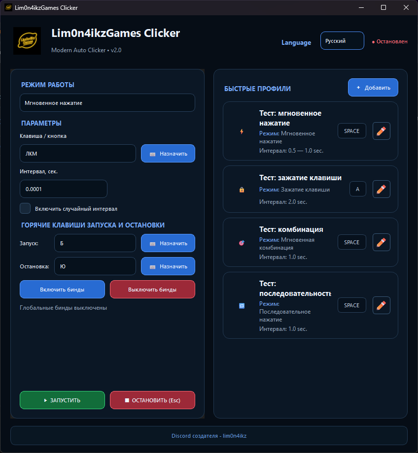

# 🍋 Lim0n4ikzGames Clicker

<p align="center">
  
</p>

<h3 align="center">
  Умный инструмент для автоматизации повторяющихся действий
</h3>

<p align="center">
  Автоматизация клавиатуры и мыши для игр, работы и повседневных задач.
</p>

<p align="center">
  
  
  
  
</p>

---

## 📖 О программе

**Lim0n4ikzGames Clicker** — лёгкая, но многофункциональная программа для автоматического нажатия клавиш и кнопок мыши.

Она создана, чтобы избавить пользователя от утомительных однообразных действий и сэкономить время.

Программа особенно хорошо подходит для игр, таких как **Majestic RP**, где приходится регулярно повторять одни и те же действия:

* копание;
* добыча ресурсов;
* работа на лесорубе;
* использование игровых автоматов;
* выполнение повторяющихся действий с быстрыми слотами;
* другие действия, требующие периодического ввода.

Помимо игр, Lim0n4ikzGames Clicker может использоваться для:

* тестирования программного обеспечения;
* автоматизации офисных операций;
* демонстрации последовательностей действий;
* повторяющихся операций с клавиатурой и мышью;
* других сценариев, требующих автоматического пользовательского ввода.

---

## 🖥️ Скриншот

<p align="center">
  
</p>

---

# 🚀 Основные возможности

## ⌨️ 4 режима работы

### ⚡ Мгновенное нажатие

Автоматическое нажатие назначенной клавиши через заданный интервал.

Можно использовать:

* фиксированный интервал;
* случайный интервал;
* клавиши клавиатуры;
* кнопки мыши.

Пример:

```text
F → ожидание → F → ожидание → F
```

---

### 🔒 Зажатие клавиши

Позволяет удерживать выбранную клавишу в течение заданного времени.

Например:

```text
W → зажать → 2 секунды → отпустить
```

Подходит для сценариев, где клавишу необходимо удерживать, а не просто нажимать.

---

### 🔄 Последовательное нажатие

Позволяет создать последовательность из нескольких клавиш.

Например:

```text
1 → 2 → 3 → F → Space
```

Для последовательности можно настроить задержку между действиями.

Это позволяет создавать простые макросы для повторяющихся действий.

---

### ⚡ Мгновенная комбинация

Позволяет одновременно нажимать несколько клавиш.

Например:

```text
Ctrl + D
Ctrl + G
Ctrl + Shift + W
Alt + Shift
Shift + W
```

Комбинации можно задавать непосредственно с клавиатуры.

---

# 🖱️ Поддержка мыши

Программа поддерживает основные кнопки мыши:

| Кнопка         | Обозначение |
| -------------- | ----------- |
| Левая кнопка   | ЛКМ         |
| Правая кнопка  | ПКМ         |
| Средняя кнопка | СКМ         |
| Боковая кнопка | X1          |
| Боковая кнопка | X2          |

Это позволяет использовать кликер для различных игровых и рабочих сценариев.

---

# ⏱️ Гибкая настройка интервалов

Для автоматизации можно задать минимальный и максимальный интервал.

Например:

```text
Минимальный интервал: 8.6 сек
Максимальный интервал: 9.0 сек
```

В этом случае программа автоматически выбирает случайное значение между указанными параметрами.

### Пример

```text
8.73 сек
8.91 сек
8.64 сек
8.97 сек
8.82 сек
```

Такой режим позволяет избежать строго фиксированного интервала между действиями.

---

# 🎮 Для Majestic RP

Lim0n4ikzGames Clicker может использоваться для автоматизации повторяющихся игровых действий в **Majestic RP**.

### 📋 Встроенная памятка

| Сценарий                    |  Интервал | Клавиша                  |
| --------------------------- | --------: | ------------------------ |
| 🪱 Копка червей             | 8.6–9 сек | Быстрый слот `1 / 2 / 3` |
| 🎰 Казино                   |   8–9 сек | `F`                      |
| 🌲 Лесоруб / шахта / карьер |  0.01 сек | `ЛКМ`                    |
| 📦 Приём ИРП                |  7200 сек | Быстрый слот `1 / 2 / 3` |

> ⚠️ **Важно:** использование программ автоматизации может нарушать правила конкретного игрового сервера. Перед использованием ознакомьтесь с актуальными правилами проекта. Разработчик не несёт ответственности за возможные санкции со стороны администрации игры.

---

# 🔥 Горячие клавиши

Программа поддерживает глобальные горячие клавиши, которые работают даже тогда, когда окно кликера не находится в фокусе.

По умолчанию:

```text
F6 — запуск
F7 — остановка
```

Горячие клавиши можно настроить под свои предпочтения.

---

# 🎨 Интерфейс

Lim0n4ikzGames Clicker имеет простой и понятный интерфейс.

Основные разделы:

```text
🖱️ Одиночный клик
⌨️ Комбинации
📍 Координаты
⚙️ Настройки
```

Все параметры сгруппированы по логическим блокам, чтобы нужные настройки было легко найти.

Также предусмотрено переключение между:

```text
🇷🇺 Русский
🇬🇧 English
```

одним нажатием.

---

# 🛡️ Безопасность и прозрачность

Lim0n4ikzGames Clicker:

* не взаимодействует с памятью игр;
* не модифицирует игровые файлы;
* не внедряется в процессы игр;
* не изменяет игровые данные;
* только имитирует нажатия клавиатуры и мыши.

Исходный код проекта доступен для просмотра и аудита.

> ⚠️ Несмотря на это, перед запуском любой сторонней программы рекомендуется самостоятельно проверять используемую версию и источник её получения.

---

# 📦 Скачать

## 🚀 Последняя версия

Готовую версию программы можно найти в разделе **Releases** этого репозитория.

**⬇️ Скачать Lim0n4ikzGames Clicker**

> В будущем здесь будет размещена ссылка на актуальный релиз.

---

# 💻 Системные требования

| Требование                    | Значение                        |
| ----------------------------- | ------------------------------- |
| 🖥️ ОС                        | Windows 7 / 8 / 10 / 11         |
| 🏗️ Архитектура               | 64-bit                          |
| 🐍 Python                     | Не требуется для `.exe`         |
| ⚙️ .NET Framework             | Не требуется                    |
| 📦 Visual C++ Redistributable | Обычно уже установлен в системе |

Программа распространяется в собранном виде, поэтому для запуска готового `.exe` отдельная установка Python не требуется.

---

# 🛠️ Технические детали

Проект написан на **Python**.

Используемые технологии:

* **Python**
* **Tkinter**
* **pynput**
* **PyInstaller**
* **Inno Setup**

### Сборка

Исполняемый файл создаётся с помощью **PyInstaller**.

Установщик создаётся с использованием **Inno Setup**.

---

# 🐍 Запуск из исходного кода

Если вы хотите запустить программу непосредственно из исходников, потребуется:

* Windows;
* Python 3.x.

### Клонирование репозитория

```bash
git clone https://github.com/YOUR_USERNAME/Lim0n4ikzGamesClicker.git
```

### Переход в директорию

```bash
cd Lim0n4ikzGamesClicker
```

### Установка зависимостей

```bash
pip install -r requirements.txt
```

### Запуск

```bash
python Lim0n4ikzGamesClicker.py
```

---

# 🔨 Сборка программы

Установите PyInstaller:

```bash
pip install pyinstaller
```

После этого выполните:

```bash
pyinstaller Lim0n4ikzGamesClicker.spec
```

Готовая программа появится в:

```text
dist/
```

---

# 📁 Структура проекта

```text
Lim0n4ikzGamesClicker/
│
├── 📁 screenshots/
│   └── main.png
│
├── 📁 build/
│
├── 📁 dist/
│   └── Lim0n4ikzGamesClicker.exe
│
├── 📄 Lim0n4ikzGamesClicker.py
├── 📄 Lim0n4ikzGamesClicker.spec
├── 🖼️ lim0n4ikzgames.ico
├── 📄 requirements.txt
└── 📄 README.md
```

---

# 🐛 Сообщить об ошибке

Если вы нашли ошибку, создайте **Issue** в этом репозитории.

Пожалуйста, укажите:

1. Версию Windows.
2. Версию Lim0n4ikzGames Clicker.
3. Используемый режим.
4. Используемые клавиши.
5. Что должно было произойти.
6. Что произошло на самом деле.

### Пример

```text
Режим:
Мгновенная комбинация

Комбинация:
Ctrl + D

Ожидаемый результат:
Нажатие Ctrl + D

Фактический результат:
Комбинация не выполняется

ОС:
Windows 11
```

# 🤝 Поддержка проекта

Если **Lim0n4ikzGames Clicker** оказался для вас полезным:

⭐ **Поставьте Star этому репозиторию**

Это помогает проекту развиваться и мотивирует добавлять новые возможности.

Если вы нашли ошибку или у вас есть идея для новой функции — создайте **Issue**.

---

# 📬 Контакты

**Разработчик:** `lim0n4ikz`

**Discord:** `lim0n4ikz`

По вопросам, предложениям и сотрудничеству можно связаться с разработчиком через Discord.

---

# 📜 Лицензия

Программа распространяется бесплатно, **«как есть»**.

Разрешается:

* использовать программу;
* распространять программу без изменений.

Запрещается:

* модифицировать исходный код;
* распространять изменённые версии;
* использовать код или программу в коммерческих целях

без предварительного согласования с автором.

---

<p align="center">

## 🍋 Lim0n4ikzGames Clicker

**Simple. Fast. Powerful.**

Made with ❤️ by **lim0n4ikz**

</p>
